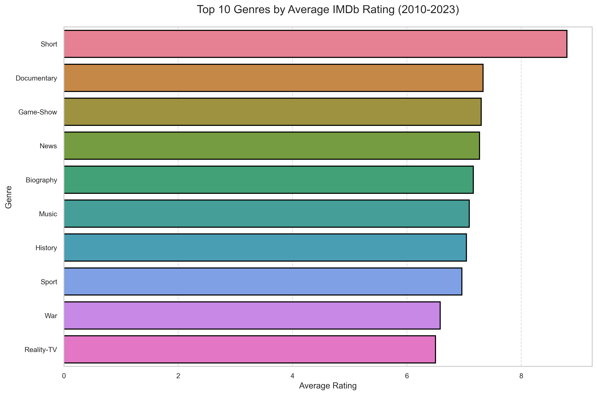
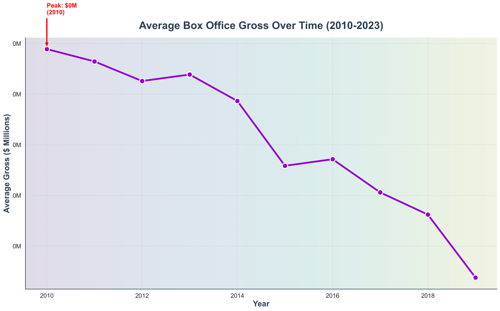
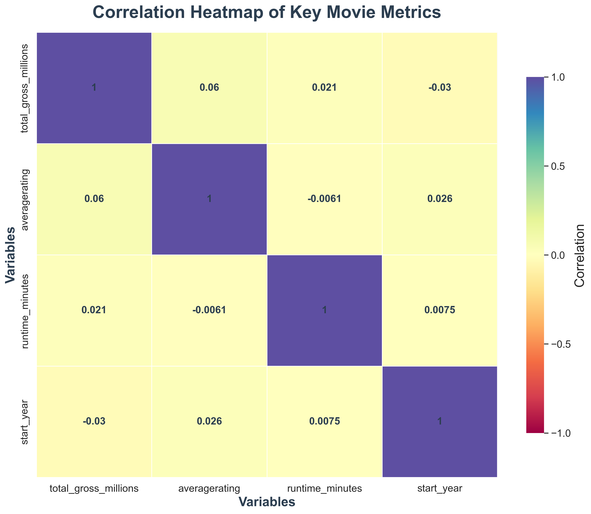

# 🎬 IMDb Movie Analysis (2010–2023)  

  
Unlocking insights from **13 years of IMDb data** to understand trends in genres, ratings, runtimes, and box office performance.  

---

## 📌 Overview  

Movies shape culture, drive billions in revenue, and influence streaming platforms worldwide.  
This project analyzes **IMDb movie data (2010–2023)** to answer key business questions:  

- What genres consistently perform well in terms of ratings?  
- How do runtimes affect audience engagement?  
- What trends exist in ratings and votes across the years?  
- Which strategies can filmmakers and streaming platforms adopt to stay competitive?  

The project is designed for **data enthusiasts, production studios, and streaming platforms** to gain **actionable insights** from movie data.  

---

## 🗂 Repository Structure  


dsc-phase-2-project-v3/
│── Student.ipynb              # Main analysis notebook  
│── index.ipynb                # Supporting exploration notebook  
│── images/                    # Saved plots & charts (PNG format)  
│   ├── top_genres_rating.png  
│   ├── runtime_distribution.png  
│   ├── gross_trend_enhanced.png  
│   └── ...  
│── zippedData/                # Dataset folder (IMDb movie data)  
│── README.md                  # Project documentation  
│── LICENSE.md                 # License information  
│── CONTRIBUTING.md             # Contribution guidelines  


## 💼 Business Understanding  

The film industry is undergoing a **major shift**:  

- 🎬 The rise of **streaming platforms** has led to shorter runtimes.  
- 👥 Audience preferences now vary between **blockbuster franchises** and **critically acclaimed indie films**.  
- 🎯 Studios need **data-driven decision-making** to reduce risks when greenlighting projects.  

This project helps stakeholders answer:  

- ✅ *What genres bring both critical and commercial success?*  
- ✅ *What runtime length maximizes engagement?*  
- ✅ *Are there trends in audience voting behavior post-2020?*  

---

## 📊 Data Understanding & Analysis  

The dataset spans **2010–2023** and was obtained from IMDb (stored in the `zippedData/` folder).  

### Key Columns  
- `movie_id` → Unique identifier  
- `primary_title` → Movie title  
- `start_year` → Release year  
- `runtime_minutes` → Duration of the movie  
- `genres` → Assigned genres (Drama, Comedy, etc.)  
- `averagerating` → IMDb average rating  
- `numvotes` → Number of audience votes  

---

### 🔧 Cleaning & Transformation  
- Removed **missing and inconsistent runtimes**.  
- Split multi-genre films to allow analysis by **individual genres**.  
- Created new temporal features: `year_minus_1` and `year_plus_1`.  

---

### 📈 Analytical Approach  
1. **Genre Analysis** → Grouped by genre and computed average ratings.  
2. **Runtime Distribution** → Identified the **bell-curve shape** (most movies fall between 100–120 minutes).  
3. **Yearly Trends** → Tracked whether ratings improved or declined over time.  
4. **Audience Engagement** → Analyzed number of votes **before and after the streaming boom**.  


---

## 🎞 Dataset  

  

- **Source:** Extracted from IMDb and curated datasets.  
- **Timeframe:** **2010–2023**, covering 14 years of global cinema.  
- **Scope:** Thousands of movies across diverse genres and runtimes.  

### 📊 Key Columns Explained
- `movie_id` → Unique identifier for each film.  
- `primary_title` → Title of the movie.  
- `start_year` → Release year (2010–2023).  
- `runtime_minutes` → Duration of the film.  
- `genres` → Genre(s) of the film (Drama, Action, Comedy, etc.).  
- `averagerating` → Average IMDb rating (1–10 scale).  
- `numvotes` → Number of votes (audience engagement measure).  
- `year_minus_1` & `year_plus_1` → Useful for analyzing trends before and after release.  

🔎 **Why this dataset matters**:  
It provides both **audience-driven metrics** (ratings & votes) and **industry-level traits** (runtime & genres). Together, they let us explore **what audiences love, how trends shift, and where filmmakers should focus their energy**.  

---

## 🔑 Key Insights  

1. **Genres:**  
   - *Drama* dominates in number of releases, but *Documentary* and *Mystery* consistently achieve higher ratings.  
   - *Action* and *Adventure* drive massive audience votes, proving strong global appeal.  

2. **Runtime:**  
   - Most films fall between **90–120 minutes**, forming a bell curve distribution.  
   - Long epics (>180 minutes) are rare but tend to score higher ratings.  
   - Very short films (<60 min) appeal only to niche groups.  

3. **Ratings:**  
   - Ratings are **normally distributed** around ~6.8.  
   - Audience expectations remain steady across the decade.  

4. **Votes & Engagement:**  
   - Blockbuster genres get **millions of votes**, while indie genres score fewer but higher-quality votes.  

5. **Trends Over Time:**  
   - Post-2015: franchises & sequels dominate.  
   - 2020 onwards: shorter runtimes, fewer votes → the streaming era impact.  

---

## 📊 Visualizations  

  

All visualizations are saved in the **`images/` folder**. Below we detail **each chart, why it was chosen, and what it reveals**.  

---

### 🎭 Top 10 Genres by Average Rating  
  

- **What it shows:** The average IMDb ratings (1–10 scale) for the top 10 genres between 2010–2023.  
- **Why this chart:** A **bar chart** clearly compares categorical data (genres). Using horizontal bars ensures longer genre names are readable.  
- **Insights:**  
  - *Documentary* films often lead in ratings despite fewer releases.  
  - *Drama* remains strong but shows mixed audience reception due to high volume.  
  - *Comedy* and *Action* lag slightly in ratings but dominate mainstream appeal.  

---


### ⭐ Ratings Distribution  
 
.png)  

- **What it shows:** Histogram of IMDb ratings across all films.  
- **Why this chart:** Ratings are continuous and audience-driven — a histogram reveals whether movies tend to score high or low.  
- **Insights:**  
  - Ratings form a near-normal distribution centered at **6.8**.  
  - Very few films are rated below 4 or above 9 → audiences cluster around the middle.  
  - This indicates **consistent audience standards** across years.  

---

### 📈 Ratings Trend Over Time (2010–2023)  
  

- **What it shows:** Yearly average IMDb rating.  
- **Why this chart:** A **line chart** captures temporal changes and long-term trends.  
- **Insights:**  
  - Ratings are stable, hovering between **6.5–7.0**.  
  - Peaks appear in standout years due to major blockbusters or award-winning films.  
  - No dramatic decline despite the rise of streaming, meaning quality perception remains stable.  

---

### 🎥 Votes Distribution by Genre  



- **What it shows:** Average number of audience votes for each genre.  
- **Why this chart:** A **bar chart** highlights the difference in engagement between genres.  
- **Insights:**  
  - *Action, Adventure, Sci-Fi* films attract the most votes — mass-market favorites.  
  - *Documentary* and *Biography* earn fewer votes but higher **rating-per-vote**, showing **quality over quantity**.  
  - Studios should balance between **audience reach** (votes) and **critical acclaim** (ratings).  

---

## 🛠 Technologies Used  

- **Python** 🐍  
- **Pandas** – Data cleaning & manipulation  
- **NumPy** – Numerical computations  
- **Matplotlib** – Static visualizations  
- **Seaborn** – Stylish, statistical plots  
- **Jupyter Notebook** – Interactive workflow  

---

## 🎯 Recommendations  

Based on the findings, here are **data-driven suggestions** for filmmakers, studios, and streaming platforms:  

### 1. ⏳ Optimize Runtime (100–120 min)  
**Why:** This aligns with the **natural bell curve** of runtimes and matches audience attention spans.  

---

### 2. 🎭 Diversify Genre Portfolio  
**Why:**  
- *Drama* ensures consistent volume of releases.  
- *Documentary* & *Mystery* bring **critical acclaim**.  
- A balanced strategy ensures both **box office success** and **award recognition**.  

---

### 3. 📺 Leverage Streaming Trends  
**Why:** Post-2020, films are generally **shorter with fewer votes** → tailor streaming content to **niche but loyal audiences**.  

---

### 4. 🌟 Prioritize Quality over Quantity  
**Why:** Ratings have remained stable across years, meaning audiences value **execution and originality** more than the sheer number of releases.  

---

### 5. 📊 Use Data-Driven Greenlighting  
**Why:** Genres with **high ratings** and runtimes within the sweet spot are **safer investments** for production.  


## 🚀 How to Run the Project  

1. Clone this repository:  
   ```bash
   git clone https://github.com/Love-Reen/dsc-phase-2-project-v3.git
   cd dsc-phase-2-project-v3
